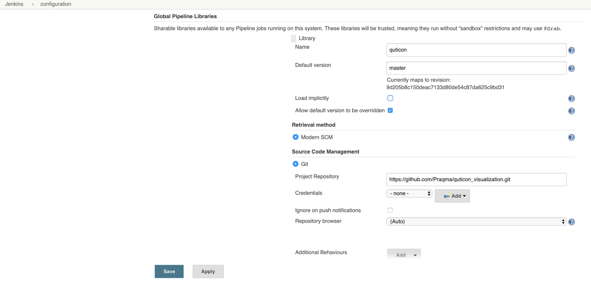

# Quticon
Quticon (QUality, TIme, CONtent) is a visualization tool for things like quality, time and content.

## Jenkins configuration

Configure [Groovy Shared library](https://jenkins.io/doc/book/pipeline/shared-libraries/) to point to this repo (Manage Jenkins -> Configure System) - we have global pipeline steps defined inside directory vars



Then create Pipeline job with name `pipeline` and add the following flow definition

```
@Library("quticon@0.3.0")
def data = jenkinsExtractor(["pipeline"], 5)
pushToELK("http://188.166.73.120:9200", "jenkins", data)
```
`jenkinsExtractor` and `pushToELK` are pipeline steps provided by quticon Groovy Shared library that we configured above. You can see their definitions [here](vars). `@Library` is a special command to load steps from quticon library. Read more about it [here](https://jenkins.io/doc/book/pipeline/shared-libraries/#using-libraries)
The first argument of `jenkinsExtractor` step is list of the job names to extract data from. In our case it is only one job `pipeline` thus `["pipeline"]`. The second argument is a time frame in the format of number of hours from now. So configration above will extract information about builds done between now and five hours back for the job with the name `pipeline`.
`pushToELK` pipeline step receives the following arguments - Elastic Search URL, index name, list of data entries extracted using `jenkinsExtractor` pipeline step.

To extract data for all jobs leave list in the first argument empty

```
@Library("quticon@0.3.0")
def data = jenkinsExtractor([], 5)
pushToELK("http://188.166.73.120:9200", "jenkins", data)
```

If you have to go through the proxy then update pushToELK call in the following way

```
@Library("quticon@0.3.0")
def data = jenkinsExtractor(["pipeline"], 5)
pushToELK("http://188.166.73.120:9200", "jenkins", data, "http", "my.proxy.com", 8080)
```

Example output of data extraction (no push to ELK). Note that we will extract pipeline stages as separate entries as well as the pipeline run itself:

```
Started by user anonymous
Loading library quticon@get-all-stages
 > git rev-parse --is-inside-work-tree # timeout=10
Setting origin to https://github.com/Praqma/quticon_visualization.git
 > git config remote.origin.url https://github.com/Praqma/quticon_visualization.git # timeout=10
Fetching origin...
Fetching upstream changes from origin
 > git --version # timeout=10
 > git fetch --tags --progress origin +refs/heads/*:refs/remotes/origin/*
 > git rev-parse get-all-stages^{commit} # timeout=10
 > git rev-parse origin/get-all-stages^{commit} # timeout=10
 > git rev-parse --is-inside-work-tree # timeout=10
Fetching changes from the remote Git repository
 > git config remote.origin.url https://github.com/Praqma/quticon_visualization.git # timeout=10
Fetching upstream changes from https://github.com/Praqma/quticon_visualization.git
 > git --version # timeout=10
 > git fetch --tags --progress https://github.com/Praqma/quticon_visualization.git +refs/heads/*:refs/remotes/origin/*
Checking out Revision 6c21e5f71f0f6682b68543b95df3cd7b1c1fccc3 (get-all-stages)
 > git config core.sparsecheckout # timeout=10
 > git checkout -f 6c21e5f71f0f6682b68543b95df3cd7b1c1fccc3
 > git rev-list 510172444d4ac8ca74a7a5d7bb4ef4299f4ec2b2 # timeout=10
[Pipeline] stage
[Pipeline] { (Get data)
[Pipeline] echo
No job names specified for extraction. Check all jobs
[Pipeline] echo
Looking for the job with the name jenkins_as_a_code-cleanup-docker
[Pipeline] echo
Found 6 builds matching time criteria for the job jenkins_as_a_code-cleanup-docker
[Pipeline] echo
New entry: name jenkins_as_a_code-cleanup-docker, result SUCCESS, number 117, duration 1369, timestamp 1491285814140, time in queue 8
[Pipeline] echo
New entry: name jenkins_as_a_code-cleanup-docker, result SUCCESS, number 116, duration 1401, timestamp 1491285812702, time in queue 7
[Pipeline] echo
New entry: name jenkins_as_a_code-cleanup-docker, result SUCCESS, number 115, duration 2022, timestamp 1491285810633, time in queue 13
[Pipeline] echo
New entry: name jenkins_as_a_code-cleanup-docker, result SUCCESS, number 114, duration 1948, timestamp 1491285808636, time in queue 14
[Pipeline] echo
New entry: name jenkins_as_a_code-cleanup-docker, result SUCCESS, number 113, duration 1603, timestamp 1491285806979, time in queue 10
[Pipeline] echo
New entry: name jenkins_as_a_code-cleanup-docker, result SUCCESS, number 112, duration 7100, timestamp 1491285799674, time in queue 45
[Pipeline] echo
Looking for the job with the name jenkins_as_a_code-pipeline
[Pipeline] echo
Found 0 builds matching time criteria for the job jenkins_as_a_code-pipeline
[Pipeline] echo
Looking for the job with the name jenkins_as_a_code-review
[Pipeline] echo
Found 0 builds matching time criteria for the job jenkins_as_a_code-review
[Pipeline] echo
Looking for the job with the name jenkins_as_a_code-seedjob
[Pipeline] echo
Found 1 builds matching time criteria for the job jenkins_as_a_code-seedjob
[Pipeline] echo
New entry: name jenkins_as_a_code-seedjob, result SUCCESS, number 2, duration 12571, timestamp 1491285799742, time in queue 70
[Pipeline] echo
Looking for the job with the name load-data
[Pipeline] echo
Found 6 builds matching time criteria for the job load-data
[Pipeline] echo
New pipeline stage entry: name load-data/Get data, result FAILED, number 14, duration 1279, timestamp 1491328551683, time in queue 0
[Pipeline] echo
New entry: name load-data, result FAILURE, number 14, duration 9653, timestamp 1491328543440, time in queue 9
[Pipeline] echo
New pipeline stage entry: name load-data/Get data, result SUCCESS, number 13, duration 2426, timestamp 1491328538048, time in queue 0
[Pipeline] echo
New pipeline stage entry: name load-data/push data, result SUCCESS, number 13, duration 80, timestamp 1491328540542, time in queue 0
```

## ELK setup

`188.166.73.120:9200` - in the pipeline configuration above is ip address and port of Elastic Search instance. You can get one for yourself by running docker-compose inside elk directory

```
# ELK requires vm.max_map_count to be set to at least 262144. Make sure to configure it on your Docker host
# Read more here https://www.elastic.co/guide/en/elasticsearch/reference/current/vm-max-map-count.html
sudo sysctl -w vm.max_map_count=262144
mkdir $HOME/elk-backup
sudo chown -R 991:991 $HOME/elk-backup
cd elk
docker-compose up -d
```

Then open in the browser `docker container ip:5601` and create Jenkins index.

```
Index name or pattern: jenkins-*
Index contains time-based events: x
Time-field name: timestamp
```

Now you are ready to explore data. Click `Management\Saved Objects\Import` and import json file from elk/kibana_exports.
That will give you first basic searches that you can open at `Discover` and eventually dasboards and visualisations. (We just need to figure out how to configure them first)

